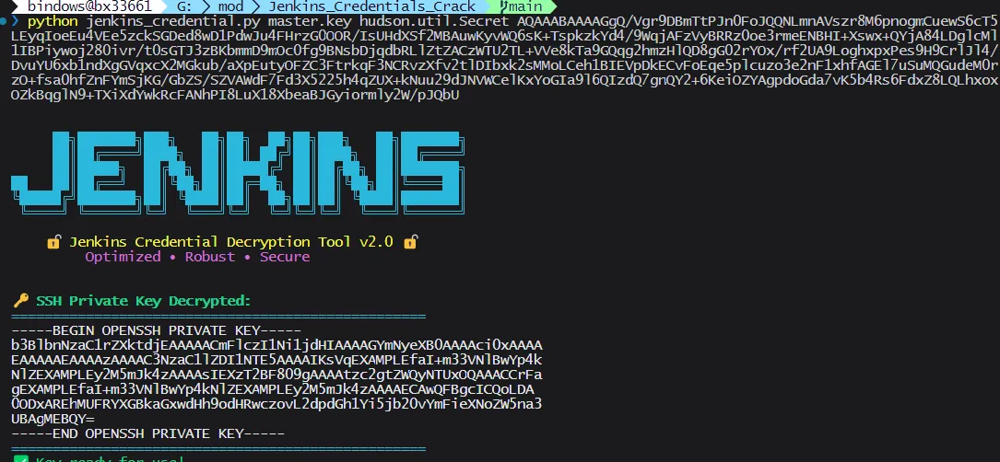

# JenkinsCredsDecoder




使用具体可以见文章
https://www.bx33661.com/blog/jenkins-credential-crack/

单条 Jenkins 凭据解密脚本（优化版）。用于在具备 master.key 与 hudson.util.Secret 的前提下，解密 Jenkins 配置或插件产生的单个加密密文。

- 支持传入密文字符串（可包含或不包含花括号）或密文文件路径
- 自动识别新/旧两种密文格式（payload_version）
- 新格式：AES-CBC + PKCS7；旧格式：AES-ECB + MAGIC 分隔
- 详细日志与更健壮的错误提示（-v/--verbose 开启调试）


## 环境要求
安装依赖：
```
pip install -r requirements.txt
# 或
pip install pycryptodome
```


## 相关文件位置（常见）
- $JENKINS_HOME/secrets/master.key
- $JENKINS_HOME/secrets/hudson.util.Secret
- 密文来源：如 credentials.xml/插件 XML 中的 {Base64...} 片段


## 使用方法
脚本：jenkins_credential.py

基本语法：
```
python3 jenkins_credential.py <master.key> <hudson.util.Secret> <密文或密文文件路径>
```

支持两种“第三个参数”形式：
- 直接传入 Base64 密文（可带或不带花括号）
- 传入一个文件路径（文件内容为密文字符串）

开启调试信息：
```
python3 jenkins_credential.py <master.key> <hudson.util.Secret> <密文或文件> -v
```

